# 🏫 Chicago Public Schools SQL Analysis
### 🎓 IBM Data Engineering Specialization – Portfolio Project

---

## 📑 Table of Contents
1. [Overview](#-overview)
2. [Analytical Objective](#-analytical-objective)
3. [Tools & Technologies](#-tools--technologies)
4. [Libraries Used](#-libraries-used)
5. [Skills Demonstrated](#-skills-demonstrated)
6. [Project Workflow](#-project-workflow)
7. [Results](#-results)
8. [About This Project](#-about-this-project)

---

## 📘 Overview
This project focuses on analyzing **Chicago Public Schools data** using SQL to uncover insights related to school safety, attendance, enrollment, and community-level indicators. PostgreSQL is used as the primary database for structured data storage, while **Jupyter Notebook** enables interactive querying and visualization to support exploratory data analysis and insight generation.

---

## 🎯 Analytical Objective
The objective of this project is to explore and analyze public education data to answer key analytical questions such as:

- How school performance varies across safety and attendance metrics  
- Which schools and community areas face lower enrollment or attendance    

This project demonstrates practical SQL-based analysis on a real-world dataset.

---

## 🛠️ Tools & Technologies
- **SQL**
- **Python**
- **PostgreSQL**   
- **Jupyter Notebook** 
  
---

## 📦 Libraries Used
- **ipython-sql** — execute SQL queries inside Jupyter Notebook  
- **psycopg2-binary** — PostgreSQL database connectivity  
- **SQLAlchemy** — database connection management
- **PrettyTable** — formatted SQL query output  
- **Pandas** — tabular data manipulation  
- **Matplotlib** — data visualization    

---

## 🎯 Skills Demonstrated
- Relational database querying  
- SQL-based data analysis  
- Schema exploration and metadata inspection  
- Handling mixed data types and missing values  
- Aggregations and conditional filtering  
- SQL-to-Python integration  
- Data visualization and insight communication  

---

## 🔄 Project Workflow

1. **Data Storage & Schema Design (PostgreSQL)**
- The workflow begins with **PostgreSQL** as the core data storage layer.  
-  Chicago Public Schools dataset was imported into PostgreSQL, and a structured table schema was created to closely match the raw CSV file. This ensured correct column ordering, appropriate data types, and reliable storage for large-scale analysis.

2. **Schema Validation & Metadata Exploration**
-  loading the data, the database schema was **validated using PostgreSQL system catalogs**.  
- Table existence, column counts, column names, and data types were reviewed through `information_schema` queries to confirm that the dataset was complete and ready for analysis.

3. **Database Connection via Jupyter Notebook**
- Once the database layer was verified, the workflow transitioned to **Jupyter Notebook**.  
- A secure connection between Jupyter Notebook and PostgreSQL was established using SQLAlchemy and `ipython-sql`, allowing SQL queries to be executed interactively while PostgreSQL remained the single source of truth.

4. **Analytical SQL Queries**
- Inside Jupyter Notebook, **analytical SQL queries** were written to explore key educational indicators such as school safety scores, student attendance, enrollment trends, and community-level patterns.  

5. **Query Results Handling with Pandas**
- The results of SQL queries were converted into **Pandas DataFrames**.  
- This step enabled easier inspection, formatting, and preparation of analytical outputs, bridging database querying with Python-based data analysis.

6. **Visual Insights & Interpretation**
- The workflow concludes with **data visualization** using Matplotlib.  
- Query results were transformed into clear, interpretable charts that highlight trends, comparisons, and key insights across schools and communities, making the findings more accessible and decision-oriented.

*This end-to-end workflow demonstrates how **PostgreSQL, SQL, Jupyter Notebook and Python** work together to move from raw data ingestion to structured analysis and meaningful visual insights.*

---

## 📊 Results

This section presents the outputs generated across database setup, analytical querying, and visualization-driven insights.

---

### 🐘 PostgreSQL — Schema, Metadata & Data Validation

| 1. Tables List |
|----------------|
| 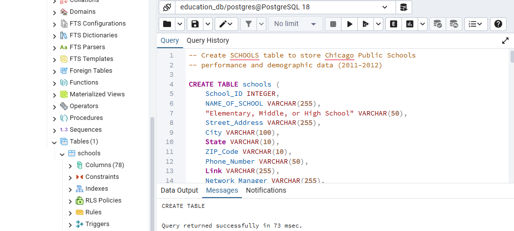 |
| List of all tables retrieved from the PostgreSQL public schema. |

---

| 2. Schools Table Columns |
|--------------------------|
| 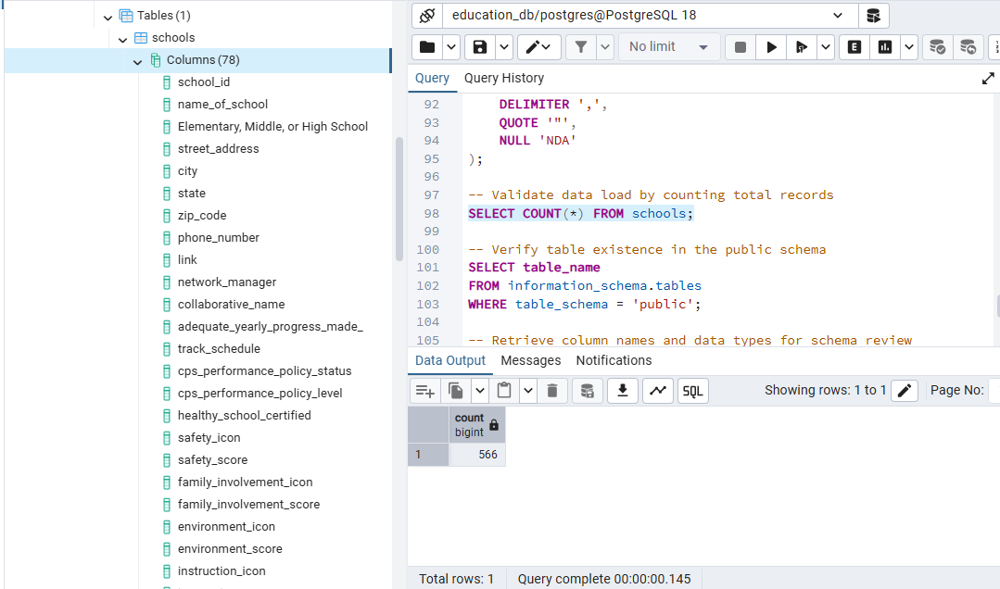 |
| Column structure of the `schools` table as created in PostgreSQL. |

---

| 3. Schools Column Data Types |
|------------------------------|
| 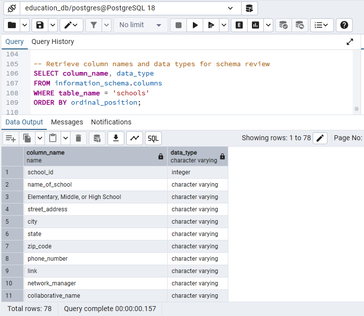 |
| Data types and ordering for all 78 columns in the dataset. |

---

| 4. Sample Records |
|-------------------|
| 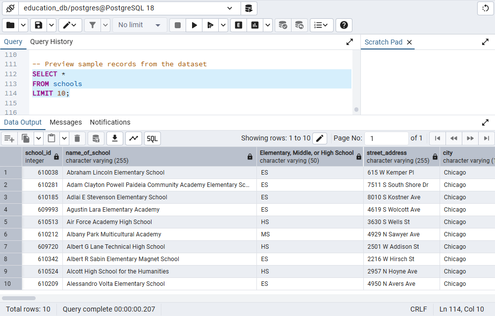 |
| Preview of sample rows from the `schools` table to validate data load. |

---

### 📓 Jupyter Notebook — Analytical SQL Queries

| 1. Elementary School Count |
|----------------------------|
|  |
| Total number of elementary schools in the dataset. |

---

| 2. Highest Safety Score |
|-------------------------|
| 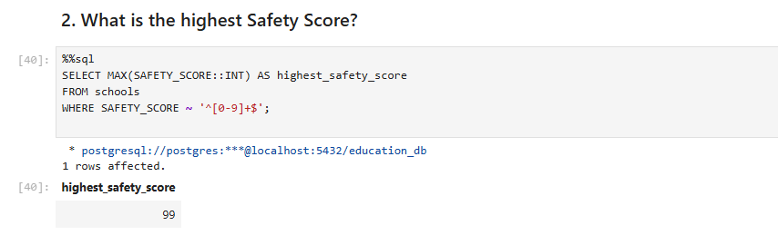 |
| Maximum safety score identified across all schools. |

---

| 3. Schools with Highest Safety Score |
|------------------------------------|
| 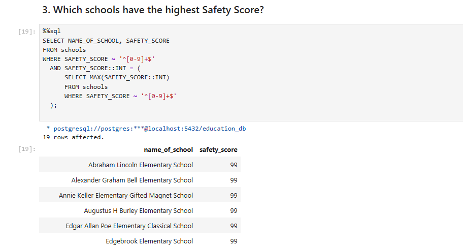 |
| Schools achieving the highest recorded safety score. |

---

| 4. Top 10 Schools by Attendance |
|--------------------------------|
| 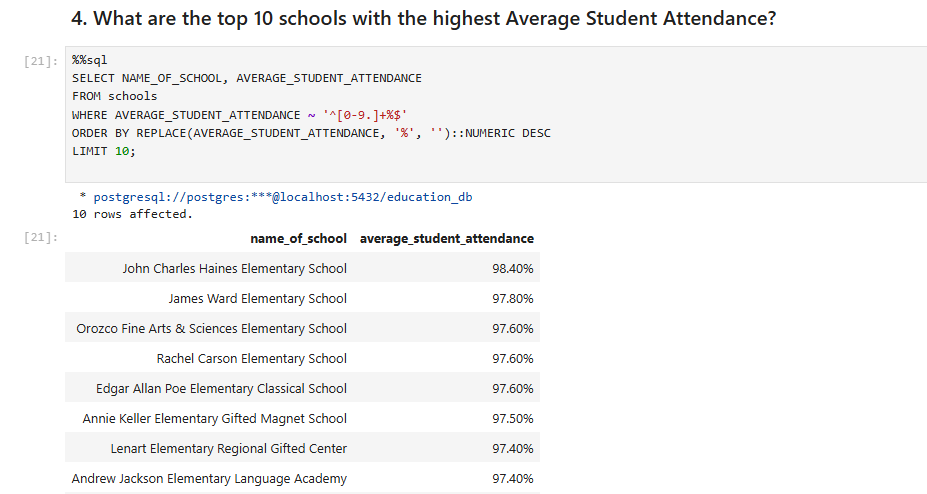 |
| Schools with the highest average student attendance rates. |

---

| 5. Lowest 5 Attendance Schools |
|--------------------------------|
| 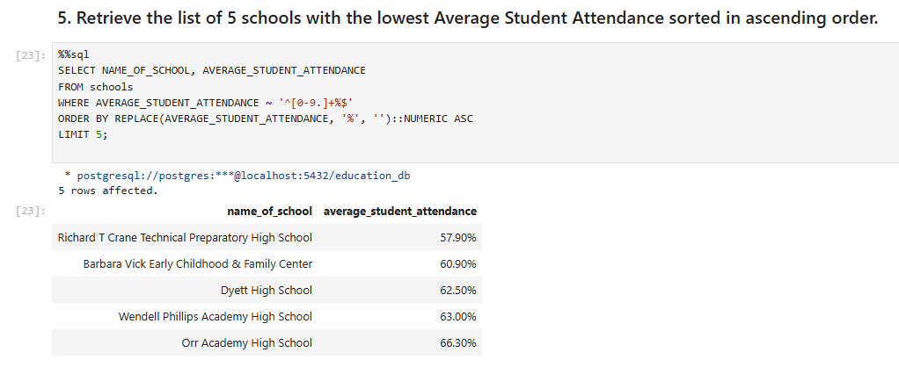 |
| Schools with the lowest attendance levels. |

---

| 6. Lowest Attendance (Numeric Only) |
|-------------------------------------|
| 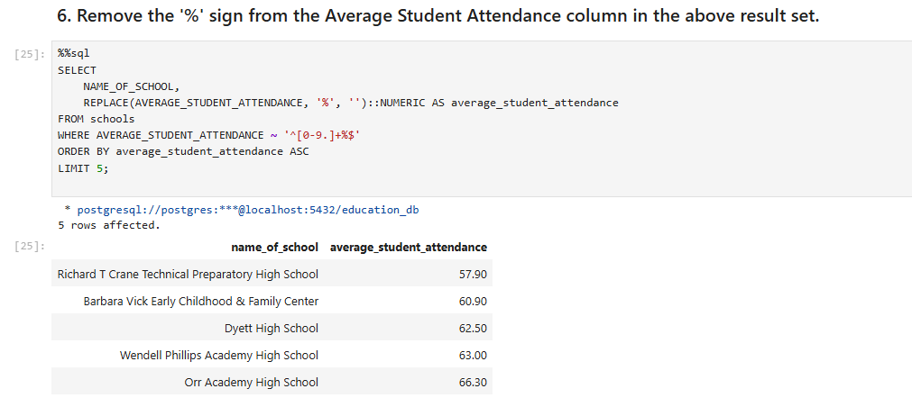 |
| Attendance values cleaned by removing percentage symbols for numeric analysis. |

---

| 7. Schools Below 70% Attendance |
|----------------------------------|
| 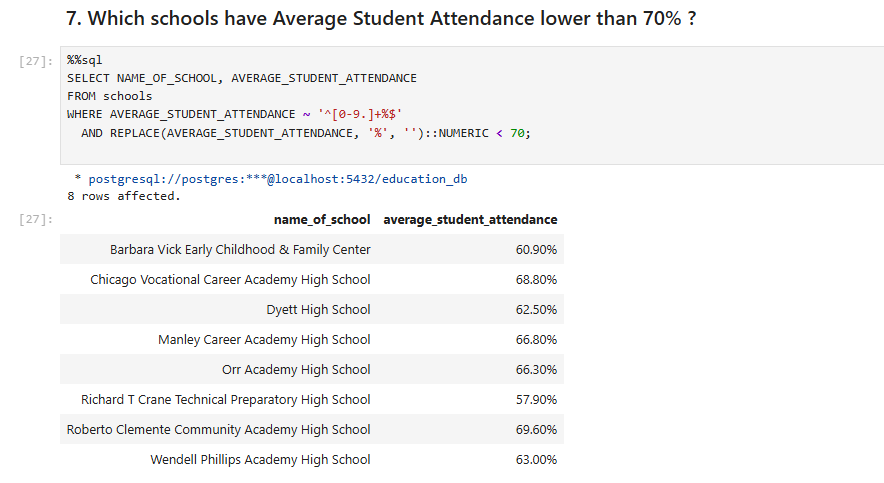 |
| Schools with average attendance lower than 70%. |

---

| 8. College Enrollment by Community |
|------------------------------------|
| 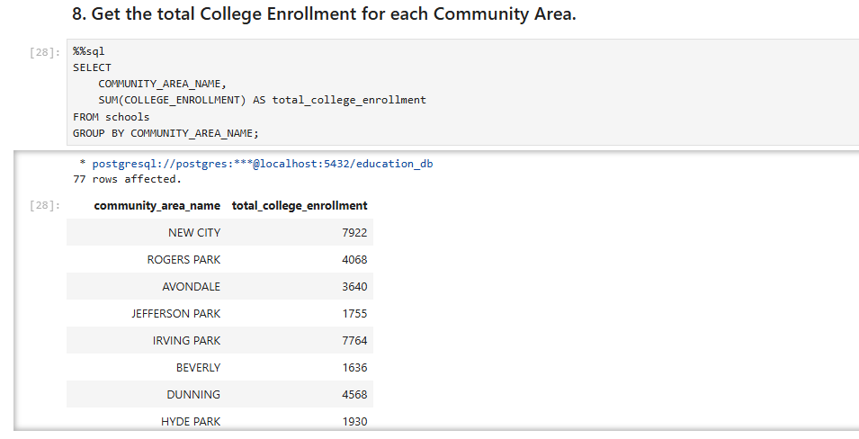 |
| Total college enrollment aggregated by community area. |

---

| 9. Lowest College Enrollment Areas |
|------------------------------------|
| 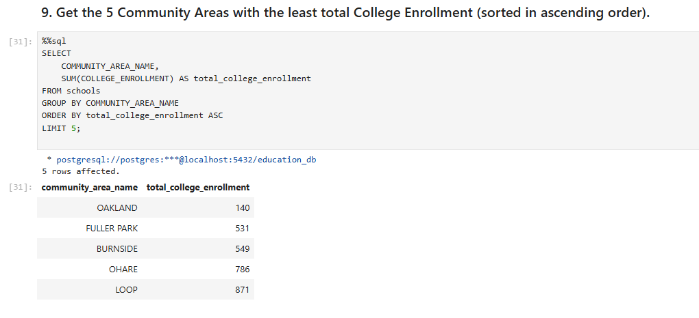 |
| Community areas with the least total college enrollment. |

---

| 10. Lowest Safety Score Schools |
|--------------------------------|
| 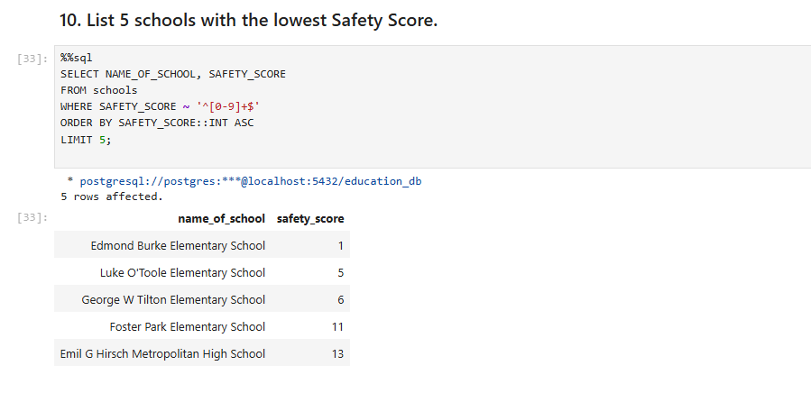 |
| Schools with the lowest recorded safety scores. |

---

### 📈 Visual Insights — Data Visualizations

| 1. Top Safety Scores (Visualization) |
|--------------------------------------|
| 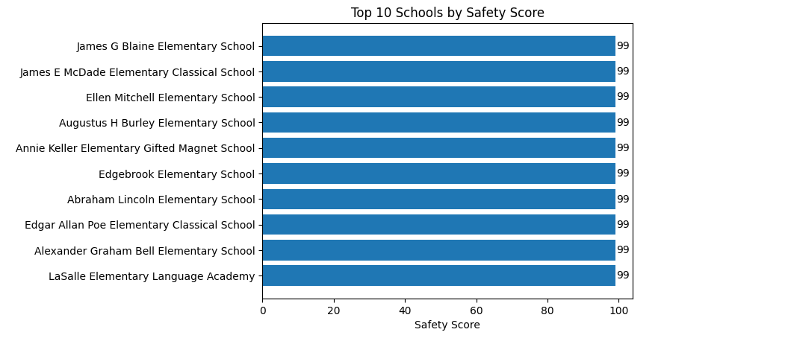 |
| Bar chart showing schools with the highest safety scores. |

---

| 2. Top Attendance Schools (Visualization) |
|--------------------------------------------|
| 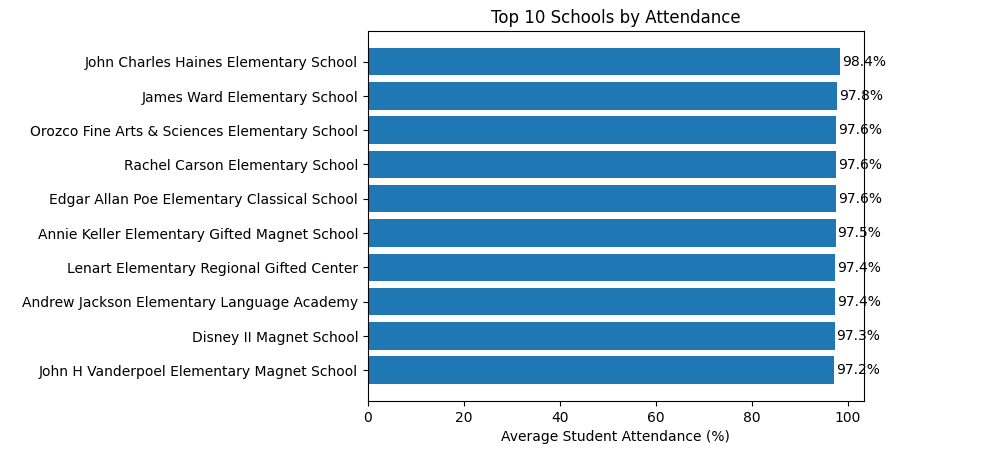 |
| Visual comparison of schools with highest attendance rates. |

---

| 3. Lowest Attendance Schools (Visualization) |
|-----------------------------------------------|
| 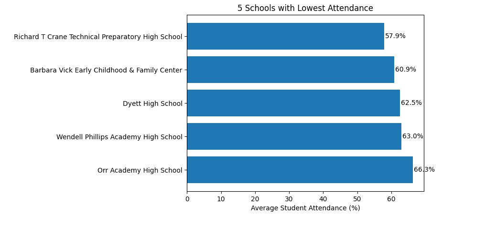 |
| Bar chart highlighting schools with the lowest attendance. |

---

| 4. Lowest Safety Scores (Visualization) |
|------------------------------------------|
| 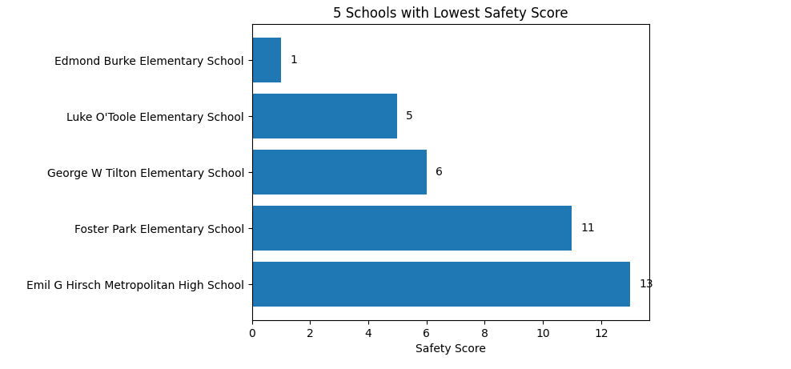 |
| Visual representation of schools with poor safety performance. |

---

| 5. College Enrollment by Community (Visualization) |
|---------------------------------------------------|
| 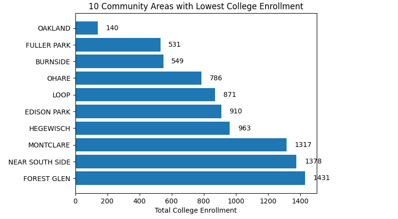 |
| Community-wise comparison of college enrollment distribution. |

*These results collectively demonstrate the **end-to-end analytical workflow**, from PostgreSQL schema validation to SQL-based analysis in Jupyter Notebook and insight-driven visual storytelling.*

---

## ℹ️ About This Project
- This project is part of the **IBM Data Engineering Professional Specialization**.
- It is structured as a **general portfolio project** to demonstrate SQL-based data analysis using PostgreSQL and Jupyter Notebook.
- The focus is on analytical thinking, query design, and insight-driven reporting.

---
